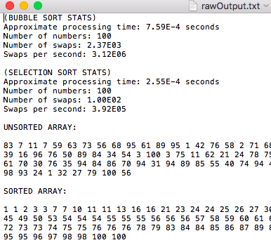

# sortingTypes

This project is purely for educational purposes as a tool to learn, not intended for actual use.
This repo contains a project intended to test the speed of different sorting algorithms by sorting an array of n numbers.

# Sort Algorithm List
List of sorting algorithm types found inside the repo, will be updated as more types are created
- Bubble Sort
- Selection Sort

# Notes:
 - Each sort class extends a parent 'SortTools' class, a class that shares primary tools used in all classes.
 - The sorts are run from a file 'sortTest' which prints out time stats on each sort algorithm

# Version 1.0 07/08/18
 - Sorts random integer arrays using bubble-sort and selection-sortTest
 - User defined sample sample size
 - Outputs time stats to the command command line
 - Outputs time stats and the unsorted/sorted arrays to an output text file found in working directory

# Upcoming Features:
 - ~~Raw data file output~~ (added in v1.0)
 - Additional sort algorithms
 - Scalable testing (e.g. 100 vs 1000 vs 10000 numbers)
